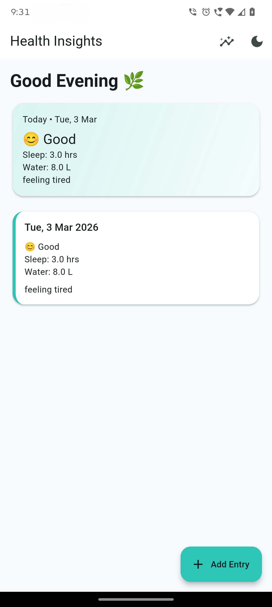
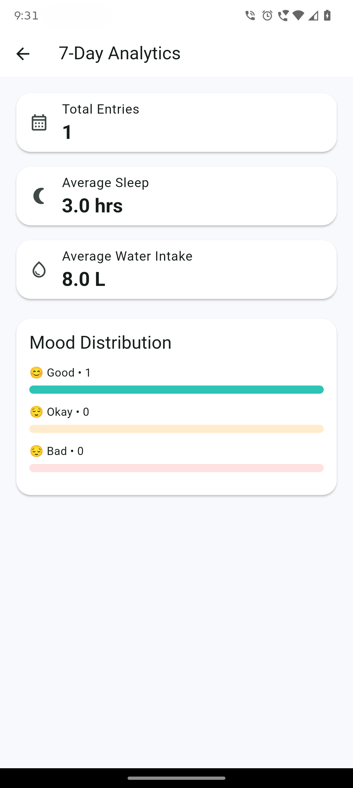
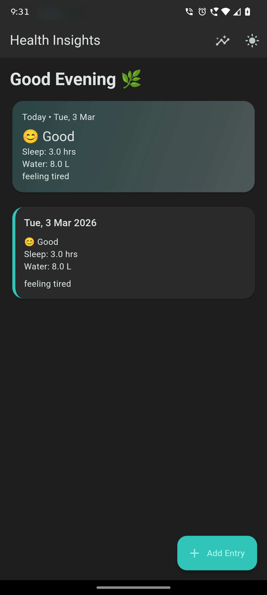

# Health Insight Tracker

Production-structured Flutter app for logging daily health entries, storing them locally, and visualizing 7-day insights.

## Architecture
Feature-first clean architecture:

- `presentation`: screens, widgets, Riverpod state notifiers/providers
- `domain`: entities, repository contracts, use cases
- `data`: Hive local datasource, models, repository implementation
- `core`: constants, reusable theme, utility validation

Core rule: business logic (validation, duplicate checks, analytics computation) lives in use cases, not in UI widgets.

## Why Riverpod
- Predictable dependency injection via providers
- State isolation with `StateNotifierProvider`
- Easy separation of `add`, `fetch`, `analytics`, and `theme mode` concerns
- Test-friendly architecture

## Why Hive
- Fast local key-value persistence
- Lightweight setup for offline-first health logs
- Strong fit for single-device, single-user journal style data

## Data Model
`HealthEntry` fields:

- `id` (`String`, UUID)
- `date` (`DateTime`)
- `mood` (`good | okay | bad`)
- `sleepHours` (`double`)
- `waterIntake` (`double`)
- `note` (`String?`)

Business rules:

- One entry per day
- `sleepHours` must be `0..24`
- `waterIntake` must be `> 0`
- Required fields cannot be empty

Hive storage:

- Box name: `health_entries`
- Key format: normalized date `toIso8601String()` (date-only)

## App Flow Diagram
```text
Splash (2s fade-in)
  -> Home (dashboard + entries)
      -> Add Entry (form + validation)
          -> Save
              -> Home (refreshed entries)
      -> Analytics (last 7 days)
```

## Implemented UI/UX
- Splash with teal->mint gradient and fade-in branding
- Dashboard with:
  - greeting section
  - today summary card
  - animated entry cards
  - pull-to-refresh
  - extended FAB (`+ Add Entry`)
- Add entry form:
  - mood chips
  - numeric inputs
  - optional note
  - loading/success/error snackbars
- Analytics:
  - total entries
  - average sleep/water
  - animated mood distribution bars
- Dark mode toggle from home app bar
- Empty, loading, and error states

## Assumptions
- "One entry per day" is based on device local date at save time.
- Entries are immutable after save (no edit/delete yet).
- Analytics considers the latest rolling 7 days including today.

## Future Improvements
- Unit tests for use cases and notifiers
- Widget tests for form validation and analytics rendering
- Edit/Delete entries
- Export/sync (cloud backup)

## Screenshots
### 1. Screen 1


### 2. Screen 2


### 3. Screen 3


### 4. Screen 4

